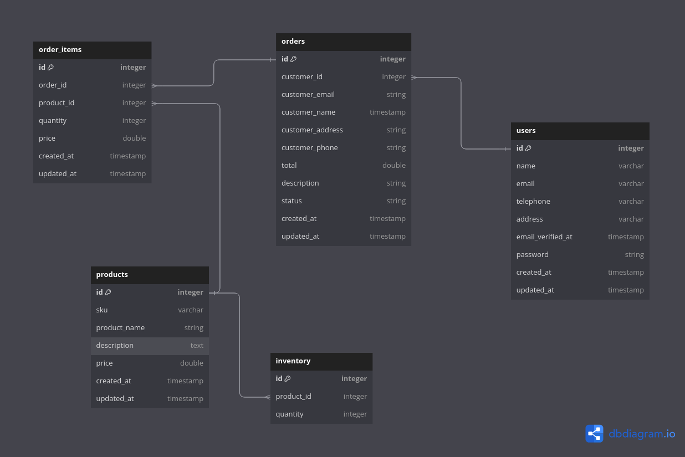

## Avocado Test Project

This repository contains a RESTful backend system based on Laravel framework that allows to monitor and manage daily user orders.

The Database structure and the interactions with it, has been developed using Eloquent ORM 

## Setup Instructions

### 1. Docker Environment creation

Ensure that Docker is installed and running on your machine. You can verify this by running the following command:
```
docker --version
```

#### Move to this directory with a terminal application

Using a terminal, navigate to this Project Folder
````
cd <project-folder>
````
#### Build the Docker Containers
Run the following command to build the Docker images for the project:
````
docker-compose build
````

#### Start the Docker Containers
Once the build is complete, start the Docker containers by running:
````
docker-compose up
````
It will pull up two containers:
***laravel-app***: the container with the PHP application, PHP version 8.1.31
***mysql***: a containerized MySql server, mysql version 8.0

### 2. Install Composer packages 
#### Enter the containerized application
To access the container, open a terminal and run the following command:
````
docker exec -it laravel-app bash
````
This command opens an interactive terminal session inside the running Docker container, from which, you can use all the Laravel tools.

To use all the project functionality in the Dockerized environment, you do***n't*** need to install Composer on your local machine since it's already pre-installed inside the Docker container.
So, just run
````
composer install
````

From now on, the application will be reachable on http://0.0.0.0:8080

You might test the correctness of the installation by checking the address in a web browser 
or performing this simple curl on a test API
````
curl http://0.0.0.0:8080/api/test-installation
````

### 3. Running Laravel Commands
Now that your Docker environment is set up, you can run Laravel-specific commands to set up the database, seed data, and execute tests.

#### Create the Database tables 
To create the needed database tables, run:
````
php artisan migrate
````

#### Seed the Data
Seed the Data: If you need to populate the database with sample data, run:
````
php artisan db:seed
````

### Run the Tests
To ensure everything is working correctly, you can run the project's tests using:
````
php artisan test
````

### Database Structure
This is a graphic diagram of the Database structure with all the relations


### Documentation
At this link you will find a documentation of the API included into the project with example of payloads and the requirements:
https://app.swaggerhub.com/apis/giovanealbert/avocado_test/1.0.0

### Stopping the Containers
To stop the Docker containers when you're done, run:
````
docker-compose up
````

## License

MIT License

Copyright (c) 2024 Emilio Albertella

Permission is hereby granted, free of charge, to any person obtaining a copy
of this software and associated documentation files (the "Software"), to deal
in the Software without restriction, including without limitation the rights
to use, copy, modify, merge, publish, distribute, sublicense, and/or sell
copies of the Software, and to permit persons to whom the Software is
furnished to do so, subject to the following conditions:

The above copyright notice and this permission notice shall be included in all
copies or substantial portions of the Software.

THE SOFTWARE IS PROVIDED "AS IS", WITHOUT WARRANTY OF ANY KIND, EXPRESS OR
IMPLIED, INCLUDING BUT NOT LIMITED TO THE WARRANTIES OF MERCHANTABILITY,
FITNESS FOR A PARTICULAR PURPOSE AND NONINFRINGEMENT. IN NO EVENT SHALL THE
AUTHORS OR COPYRIGHT HOLDERS BE LIABLE FOR ANY CLAIM, DAMAGES OR OTHER
LIABILITY, WHETHER IN AN ACTION OF CONTRACT, TORT OR OTHERWISE, ARISING FROM,
OUT OF OR IN CONNECTION WITH THE SOFTWARE OR THE USE OR OTHER DEALINGS IN THE
SOFTWARE.
